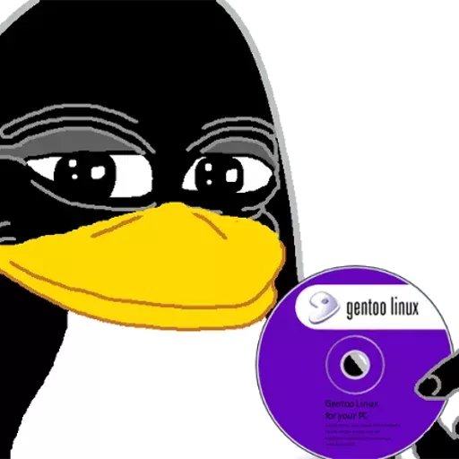

##### hey! &nbsp;  
I'm a highschooler interested in backend/fullstack development. 

My current interest include Rust, C, Docker, Linux, and more.

[](https://github.com/anuraghazra/github-readme-stats)

##### activity

<!--START_SECTION:waka-->

```text
From: 17 April 2022 - To: 24 April 2022

Rust             30 hrs 22 mins  ⣿⣿⣿⣿⣿⣿⣿⣿⣿⣿⣿⣿⣿⣿⣿⣿⣿⣿⣀⣀⣀⣀⣀⣀⣀   71.70 %
SQL              2 hrs 25 mins   ⣿⣦⣀⣀⣀⣀⣀⣀⣀⣀⣀⣀⣀⣀⣀⣀⣀⣀⣀⣀⣀⣀⣀⣀⣀   05.73 %
TypeScript       1 hr 48 mins    ⣿⣀⣀⣀⣀⣀⣀⣀⣀⣀⣀⣀⣀⣀⣀⣀⣀⣀⣀⣀⣀⣀⣀⣀⣀   04.27 %
Makefile         1 hr 25 mins    ⣷⣀⣀⣀⣀⣀⣀⣀⣀⣀⣀⣀⣀⣀⣀⣀⣀⣀⣀⣀⣀⣀⣀⣀⣀   03.35 %
JavaScript       1 hr 24 mins    ⣷⣀⣀⣀⣀⣀⣀⣀⣀⣀⣀⣀⣀⣀⣀⣀⣀⣀⣀⣀⣀⣀⣀⣀⣀   03.32 %
Markdown         1 hr 9 mins     ⣶⣀⣀⣀⣀⣀⣀⣀⣀⣀⣀⣀⣀⣀⣀⣀⣀⣀⣀⣀⣀⣀⣀⣀⣀   02.74 %
```

<!--END_SECTION:waka-->

##### ssh 

```text
ssh-ed25519 AAAAC3NzaC1lZDI1NTE5AAAAIHhssm/d0+mNX2cAhohgwOCRBjYCIQzylzRD2Hwr8lrr sean@seanray.net
```
