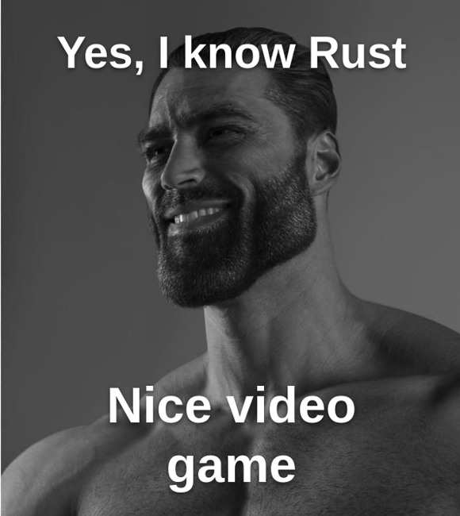
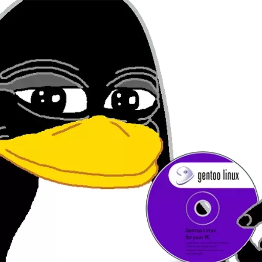

##### hey!


I'm a student interested in backend/fullstack development. 

My current interest include Rust, C, Docker, Linux, and more.


[](https://git.io/streak-stats)

[](https://github.com/anuraghazra/github-readme-stats)

##### activity

<!--START_SECTION:waka-->

```txt
From: 23 March 2026 - To: 30 March 2026

Rust          8 hrs 21 mins         ⣿⣿⣿⣿⣿⣿⣿⣿⣿⣿⣿⣄⣀⣀⣀⣀⣀⣀⣀⣀⣀⣀⣀⣀⣀   44.34 %
Python        7 hrs 9 mins          ⣿⣿⣿⣿⣿⣿⣿⣿⣿⣦⣀⣀⣀⣀⣀⣀⣀⣀⣀⣀⣀⣀⣀⣀⣀   37.94 %
Markdown      2 hrs 17 mins         ⣿⣿⣿⣀⣀⣀⣀⣀⣀⣀⣀⣀⣀⣀⣀⣀⣀⣀⣀⣀⣀⣀⣀⣀⣀   12.15 %
CSV           27 mins               ⣶⣀⣀⣀⣀⣀⣀⣀⣀⣀⣀⣀⣀⣀⣀⣀⣀⣀⣀⣀⣀⣀⣀⣀⣀   02.43 %
JSON          12 mins               ⣤⣀⣀⣀⣀⣀⣀⣀⣀⣀⣀⣀⣀⣀⣀⣀⣀⣀⣀⣀⣀⣀⣀⣀⣀   01.13 %
```

<!--END_SECTION:waka-->

##### ssh 

```text
ssh-ed25519 AAAAC3NzaC1lZDI1NTE5AAAAIHhssm/d0+mNX2cAhohgwOCRBjYCIQzylzRD2Hwr8lrr sean@seanray.net
```
